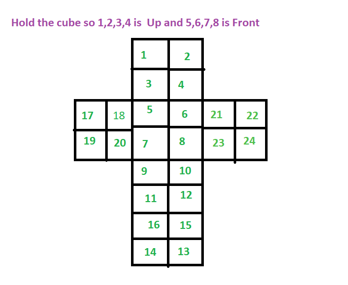

# pocket-cube-solver
A solver for the 2x2 rubiks cube also known as pocket cube. Uses <del>a recursive backtracking algortihm with memoization</del>
BFS. 
Usage:  
```
javac *.java  
java -Xms1g Solver
```

Enter 24 character string of sticker colors according to cube_diagram.png  
y-yellow  
r-red  
g-green  
b-blue  
w-white  
o-orange     
```
ygbgrobgwygyoobwbwroywrr
```
```
Shortest solution:
[R, U, U, R, F', U', R, U', F, U', F, U]
Time taken to solve: 17.166000s
```

