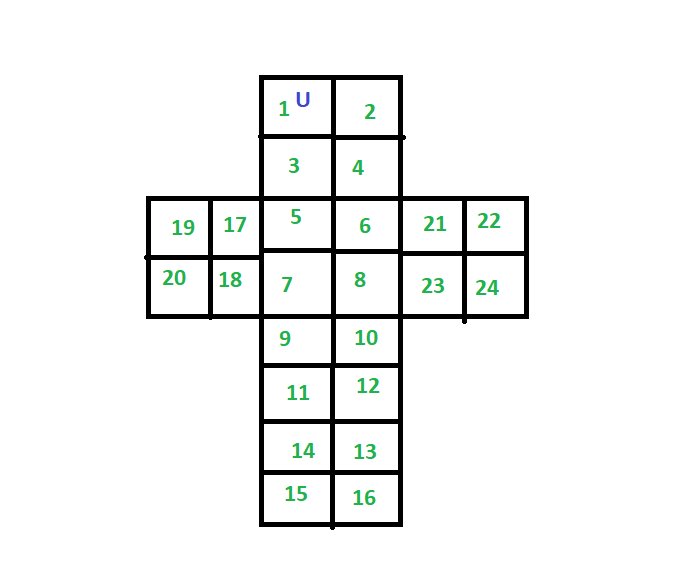

# pocket-cube-solver
A solver for the 2x2 rubiks cube alddo know as pocket cube. Uses <del>a recursive backtracking algortihm with memoization</del>
BFS. 
Usage:  
```
javac *.java  
java Solver
```

Enter a 24 character string which represents the color of the cube stickers according to the diagram  
Example:   
```
obwyroyborwywgrbwgrgboyg
```

